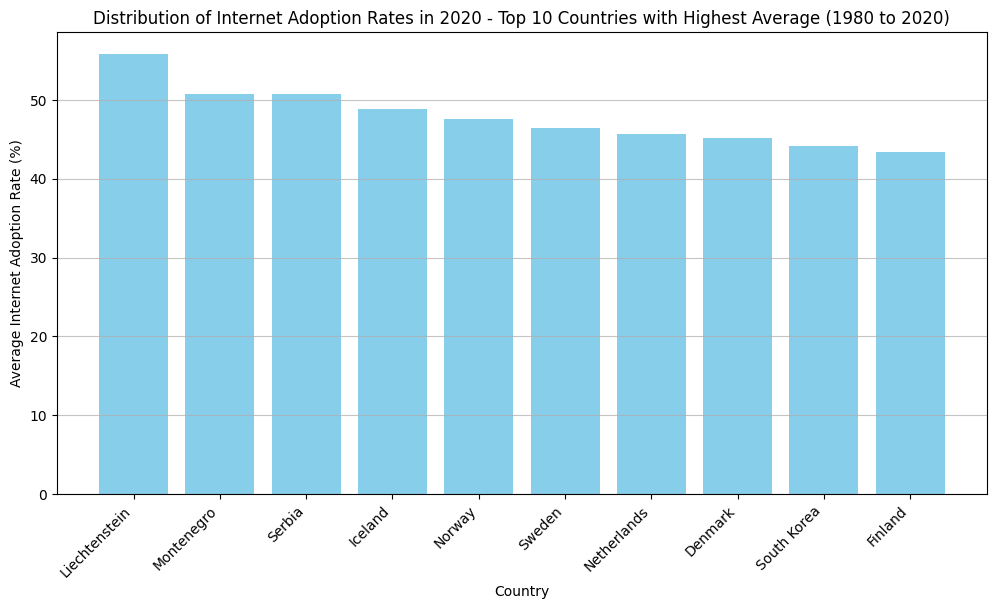
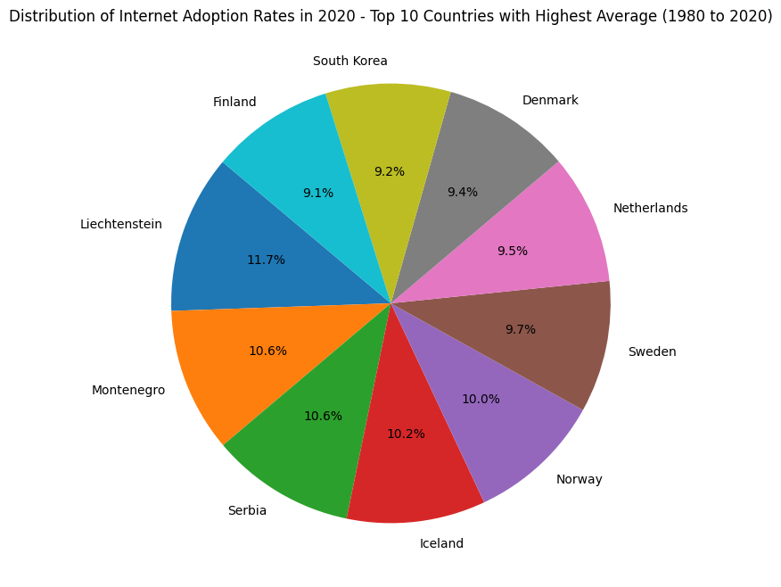
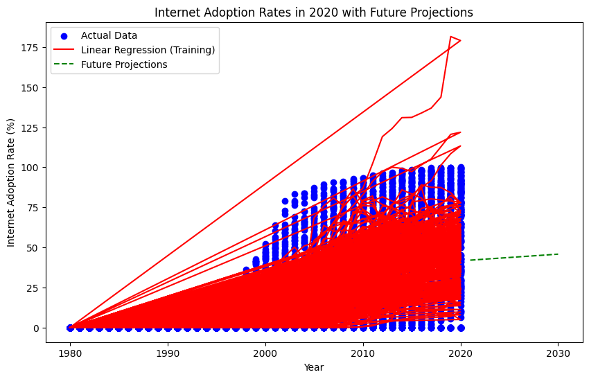
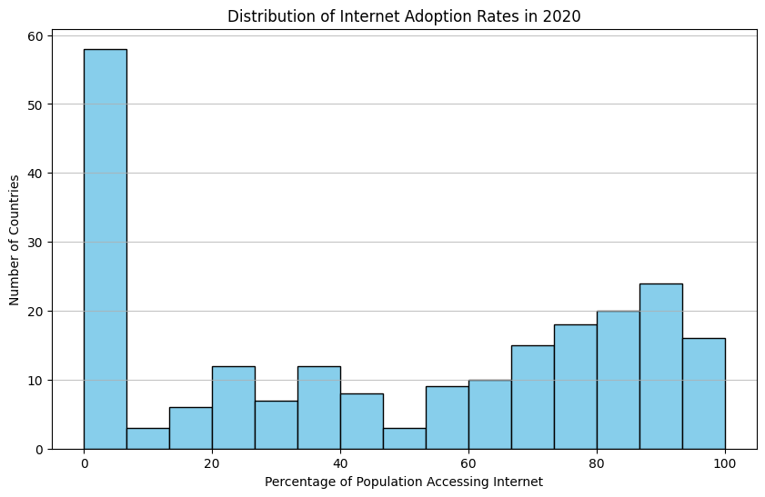
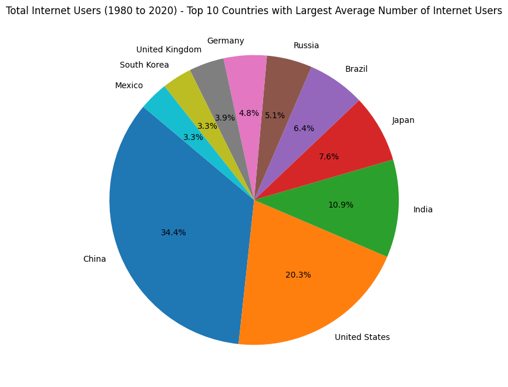
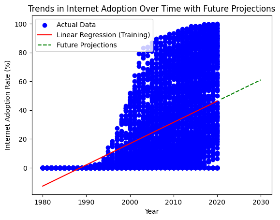
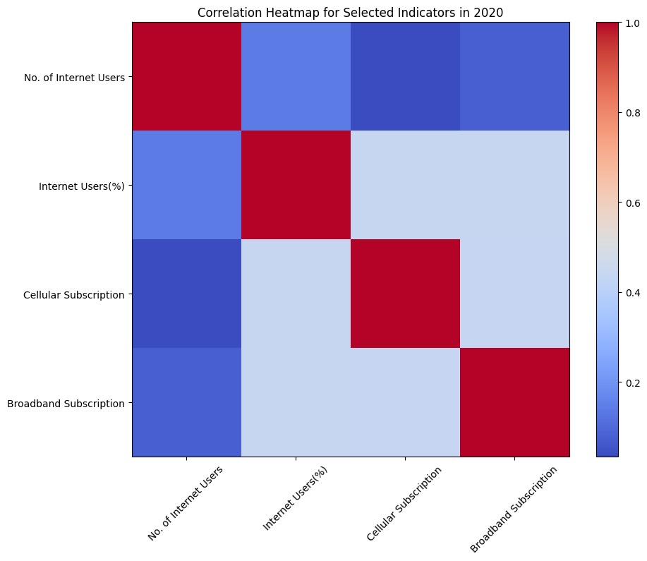
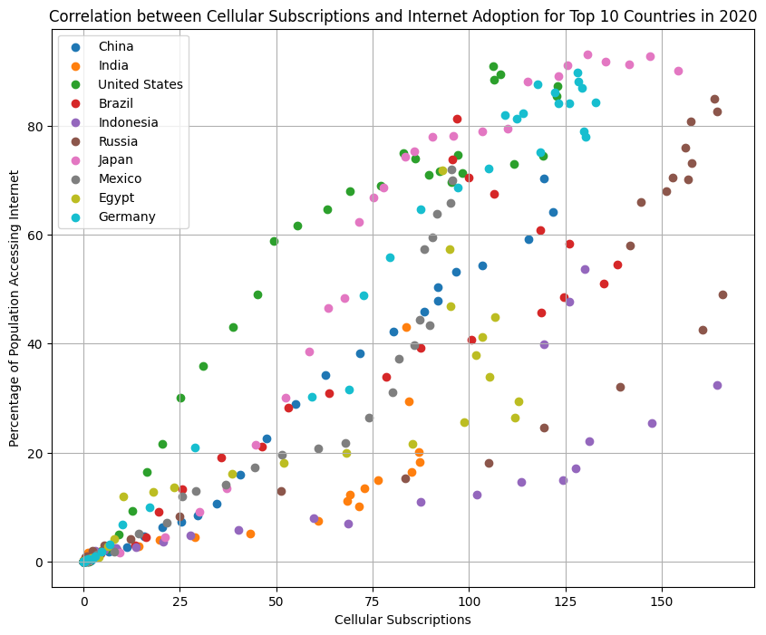

# Data-Science-Fundamentals-Individual-Project

## Introduction
The topic for this project is researching the adoption of home internet and cell service from 1980-2020 in various countries. The goal of this project is to identify trends within the data and corelation between cell service and internet adoption. Scikit is utilized to perform machine learning computations on portions of the data set to predict future trends, which are subsequently projected on data graphs for the established data to display predicted growth. This project specifically explores a comparison of average adoption rates between 1980-2020, to show which countries had the highest typical changes over the years, in addition to a display of the averages for the totals of all countries so that they can be contrasted. The current statistics that makeup current internet demographics related to country are then analyzed, where the data set is set to a scope of 10 for the sake of readability. Finally, the correlation between cell service adoption is analyzed using correlation a heatmap, and scatter plots. Machine learning using scikit was then used to identify potential future trends relating to these variables and showcased on a scatter plot visualization.

## Selection of Data
This data set is taken from Kaggle and includes all of the data spanning this 40 year timescale, as well as including all UN recognized countries for each year in the dataset. The goal of this project and it's guiding questions is to determine when internet adoption was most prevalent, what country had the highest growth in internet adoption and whether there is any relation between the rise in internet and cell service adoption on  global scale. To clean the data, a few data points that did not relate to countries needed to be removed to allow visualizations and linear regression models to only contain relevant information. The data points that referenced regions rather than countries had to be removed, not only for redundance and relevance purposed, but also because they were outlier points that took up to much space on graphs and altered the accuracy of models. The following code was used to remove such entries from the data set.

```python
dataset = dataset[(dataset["Entity"] != "World") & (dataset["Entity"] != "North America")]
```


## Methods
My approach was to provide a variety of visualizations for my topic, by choosing visualizations that would make conclusions stand out more based on the culmination of the data. For many of the questions I chose, I decided to create multiple visualizations to support conclusions, and narrow the scope of my data to provide more legible results that can be used to more appropriately address the questions posed. The most notable graphs used for this project include bars graphs to allow comparison between small and large data points, pie charts to show percentages relative to a total, scatter/line plots to show data trends over periods of time, and a heatmap to show the correlation between two variables relative to other correlations using  corresponding color key.

This project utilized jupyter notebooks for coding in python, pandas for making data subsets that can be used to compare and contrast trends to analyze correlation, and matplotlib for creating data visualizations, that allows for a predictive pattern of future data to be calculated. A machine learning library for python called Scikit was also utilized to produced linear regression models for the data. All of these modules are required to run this program locally (in addition to python) and can be installed with the command below.
```bash
pip install -U notebook pandas matplotlib scikit-learn numpy
```


## Results

###  What are the Countries with the highest average internet adoption rates from 1980 to 2020






### What countries have the highest percent of total internet users 




### What is the Correlation between a country's population acquiring a Cell service Subscriptions and Internet Adoption rates




# Discussion
Although these results seemed initially surprising, it is understandable that smaller european nations were favored as the nations with highest internet adoptions rates, due to their advanced infrastructure and less spread out populations. In larger advanced nations such as the United States, or China, there are large portions of the population that live in more rural areas, while the advanced cities are likely more responsible for growing internet adoption statistic, if the data set were exclusively focus on large metropolitan areas, the data would undoubtedly skew towards larger developed nations. Smaller countries tend to be more dense, allowing an easier adoption of internet, provided they have the wealth and development. South korea is notorious for it's development in digital infrastructure so it is no surprise that it is within these results, due to it's density, wealth, and technological development.

The results for the second portion of analysis showing current internet adoption market share, favored larger countries, due to the prevalence of present day internet connectivity. Countries with the highest populations including China, India, and the United States. Lesser developed countries with similar populations, such as Nigeria and Ethiopia, are not represented on these charts due to lack of development and internet structure. This falls in line with the previous finding that population density, wealth, and development are directly correlated with internet adoption, not just a single isolated variable. A linear regression model was then used to find coefficients for the data, the output was 0.416 for cellular subscription per 10 people and 0.416 for the number of internet users, suggesting that an it is projected tht if the data for cellular subscriptions is to increase at a rate of 1 unit, the project rate of increase would be the 0.416 value.

Using a scatter plot to identify the trends of the top 10 countries with the highest percentage of internet users in relation to the adoption of cellular subscriptions shows a clear positive correlation without before using in depth mathematical analysis. This is due to both technologies surging in popularity around the same period of time, and only advancing in their respective capabilities and reach. Look at both models it is evident that both have been on a constant rise over the past few decades, and will inevitably plateau as they reach an almost complete market share. Scikit can then be utilized to legitimize these predictions using predictive model that showcases as consistent rise, in addition to the training predictions used to arrive at these conclusions. Linear regression was then used to find a mathematical "r squared" value, a value that reflects the variability of data and outputted  a value of 0.6737199276204084. Since the values of r squared range from 0-1, where 1 is the highest correlation, This linear regression model echoes the sentiment of the heatmap that these two variables have significant degree of correlation that is not absolute.


# References
Raut, A. (2022). Internet Users, Version 1. Retrieved 2023 from https://www.kaggle.com/datasets/ashishraut64/internet-users

scikit-learn. (2023, November 26). scikit-learn: Machine Learning in Python. Retrieved November 26, 2023, from https://scikit-learn.org/stable/

Matplotlib. (2023, November 26). Matplotlib Documentation. Retrieved November 26, 2023, from https://matplotlib.org/stable/index.html

Simplilearn. (2023, November 26). Scikit-Learn Tutorial: Linear Regression with Examples. Retrieved November 26, 2023, from https://www.simplilearn.com/tutorials/scikit-learn-tutorial/sklearn-linear-regression-with-examples
