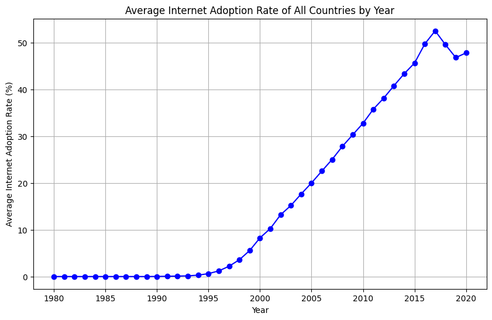

# Data-Science-Fundamentals-Individual-Project


## Selection of Data
The topic for this project is researching the adoption of home internet and cell service from 1980-2020 in various countries. This data set is taken from Kaggle and includes all of the data spanning this 40 year timescale, as well as including all UN recognized countries for each year in the dataset. The goal of this project and it's guiding questions is to determine when internet adoption was most prevalent, what country had the highest growth in internet adoption and whether there is any relation between the rise in internet and cell service adoption on  global scale.

### Questions
1. What are the Countries with the highest average internet adoption rates from 1980 to 2020
2. What countries have the highest percent of total internet users 
3. What is the Correlation between a country's population acquiring a Cell service Subscriptions and Internet Adoption rates

## Methods
My approach was to provide a variety of visualizations for my topic, by choosing visualizations that would make conclusions stand out more based on the culmination of the data. For many of the questions I chose, I decided to create multiple visualizations to support conclusions, and narrow the scope of my data to provide more legible results that can be used to more appropriately address the questions posed. The most notable graphs used for this project include bars graphs to allow comparison between small and large data points, pie charts to show percentages relative to a total, scatter/line plots to show data trends over periods of time, and a heatmap to show the correlation between two variables relative to other correlations using  corresponding color key.

This project utilized jupyter notebooks for coding in python, pandas for making data subsets and matplotlib for creating data visualizations. These modules are required to run this program locally (in addition to python) and can be installed with the command below.
```bash
pip install -U notebook pandas matplotlib scikit-learn numpy
```


## Results




# Discussion

# Summary

# References
