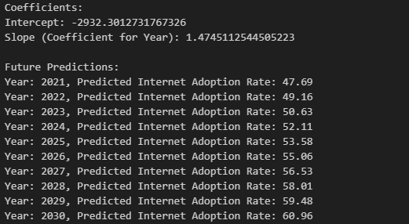
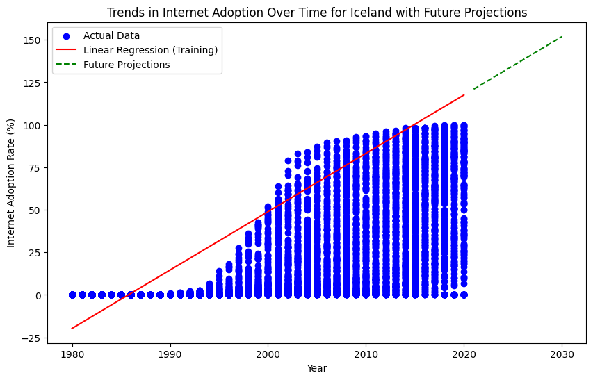
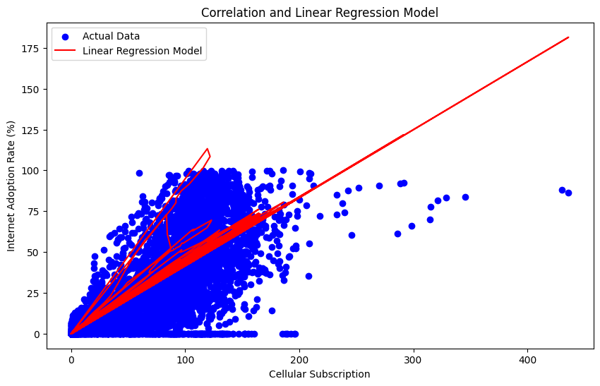

# Data-Science-Fundamentals-Individual-Project

## Introduction
The topic for this project is researching the adoption of home internet and cell service from 1980-2020 in various countries. The goal of this project is to identify trends within the data and correlation between cell service and internet adoption. Scikit is utilized to perform machine learning computations on portions of the data set to predict future trends, which are subsequently projected on to data graphs of the established data to display predicted growth. This project specifically explores a comparison of average adoption rates between 1980-2020, to show which countries had the highest typical changes over the years, in addition to a display of the averages for the totals of all countries so that they can be contrasted. The statistics that makeup current internet demographics related to country are then analyzed, where the data set is set to a scope of 10 future years to provided better readability. Finally, the correlation between cell service adoption is analyzed using a correlation heatmap, and scatter plots. Machine learning using scikit was then used to identify potential future trends relating to these variables and showcased on a scatter plot visualization.

## Selection of Data
This data set is taken from Kaggle and includes all of the data concerning internet and cellular adoption for a 40 year timescale, as well as including all UN recognized countries for each year in the dataset. The goal of this project and it's guiding questions is to determine when internet adoption was most prevalent, what country had the highest growth in internet adoption and whether there is any relation between the rise in internet and cell service adoption on  global scale, which this data set will be able to satisfy with the given categories. To clean the data, a few data points that did not relate to countries needed to be removed to allow visualizations and linear regression models to only contain relevant information that is easily understandable. The data points that referenced regions rather than countries had to be removed, not only beause this project focuses on specifically countries, but also because these points were outlier reslts that took up to much focus on graphs and altered the accuracy of prediction models. The following code was used to remove such entries from the data set.

```python
dataset = dataset[(dataset["Entity"] != "World") & (dataset["Entity"] != "North America")]
```


## Methods
My approach was to provide a variety of visualizations for my topic, by choosing visualizations that would make conclusions stand out more based on the culmination of the data. For many of the questions I chose, I decided to create multiple visualizations to support conclusions, and narrow the scope of my data to provide more legible results that could be used to more appropriately address the questions posed. The most notable graphs used for this project include bar graphs to allow comparison between small and large data points, pie charts to show percentages relative to a total, scatter/line plots to show data trends over periods of time, and a heatmap to show the correlation between two variables relative to other correlations using a corresponding color key. Scikit-learn was then used to provide linear regression models for each subset of data that was used in graphs, allowing predictive data points to be generated. These predicted trends were then added to the graph, so that predictive data could be visually analyzed next to established data.

### Tools
* Jupyter Notebook: used as a python coding environment
* Pandas: used for making data subsets that can be used to compare and contrast trends to analyze correlation
* Matplotlib: used to creating data visualizations, that allows for a predictive pattern of future data to be calculated. 
* scikit-learn: A machine learning library for python used for producing linear regression models for portions of the dataset. 

All of these modules are required to run this program locally (in addition to python) and can be installed with the command below.
```bash
pip install -U notebook pandas matplotlib scikit-learn numpy
```


## Results

###  What are the Countries with the highest average internet adoption rates from 1980 to 2020


This graphs shows the top 10 countries with the highest adoption rate in bar format. Countries with the highest average adoption rate through the years are on the left side, with lower averages as the trend of the graph descends towards the right side.


This graph shows the internet adoption rate percent data from 1980 to 2020, in addition to future projections that were generated utilizing machine learning (scikit-learn). These possible projections are shown on the graph in red, as well as the final future projection that was calculated, which is shown in green. The red lines are simply regression model training predictions, and do not represent actual results. The future projection are a slight increase in percentage over the next decade that is in line with the apparent plateau shaped trend of the data.



This is a non visualized linear regression model that calculated the next decade of data points using machine learning. The data generated shows a small, but consistent increase in percentage of the data points in future years.


### What countries have the highest percent of total internet users, and what country will have the largest increase in internet users in the near future.


This is a pie chart representing a snapshot of the top 10 countries with the highest portion of internet users. The leading countries include China, The United States, and India. These countries make up over half of the chart due to their high populations.


This is linear regression model that was used to determine the country with the highest rate of internet adoption over the next ten years of data. The model concluded that iceland had the highest rate of change. This result was determined by machine learning and is depicted by the red/green lines on the visualization, red being the trend calculation based on current data, and the green being predicted data.


The rate of change for the country country with the highest predicted internet adoption was also calculated and resulted in a projected 151.83% increase over the next ten years, which is a very significant change, relative to the results of other nations. 


### What is the Correlation between a country's population acquiring a Cell service Subscriptions and Internet Adoption rates


This graph is a correlation map that shows a dark red tone for variables that have higher correlation, and a dark blue for lower correlation, with lighter tones being moderate correlation. It can be concluded from this graph that number of internet users and cellular subscriptions have moderate but not definitive correlation. It also shows that the percentage of internet users is partially correlated with the percentage of internet users which is an expected result.


This is a scatter plot that shows the correlation between cellular adoption rates and the percentage of people accessing the internet. Each country has multiple data points, one for each year, that are responsible for the positive trend of the data, as the rates tend to increase each year as technology becomes more available.



This is a visual linear regression model that identifies the trends of the data presented with red lines, which in this case analyzes internet adoption rates and cellular subscriptions. It shows that the variables are somewhat correlated, and that this correlation will remain constant in the future.


This is the R-Squared calculation of the data that determines the variability of the data provided. This is calculated using linear regression and the result is a number between 0 and 1, 1 being the highest commonality. In this case the result was 0.42, which means for every 1 unit increase, the other variable changes 0.42 units, meaning that some significant correlation is present between the two variables.


# Discussion
Although these results seemed initially surprising, it is understandable that smaller European nations were favored as the nations with the highest internet adoption rates, due to their advanced infrastructure and less spread-out populations. In larger advanced nations such as the United States, or China, there are large portions of the population that live in more rural areas, while the advanced cities are likely more responsible for growing internet adoption statistic, if the data set were exclusively focused on large metropolitan areas, the data would undoubtedly skew towards larger developed nations. Smaller countries tend to be more dense, allowing an easier adoption of the internet, provided they have the wealth and development capabilities. South Korea is notorious for its development in digital infrastructure, so it is no surprise that it is present within these results, due to its density, wealth, and technological development.

The results for the second portion of the analysis shows current internet adoption market share, which favored larger countries, due to the prevalence of internet connectivity necessary for larger populations. Countries with the highest populations include China, India, and the United States. Lesser developed countries with similar populations, such as Nigeria and Ethiopia, are not represented on these charts due to lack of development and need for internet infastructure. This falls in line with the previous finding that population density, wealth, and development are directly correlated with internet adoption, not just a single isolated variables. A linear regression model was then used to determine what nation would likely have the highest rate of adoption within the near future, and the the nation of iceland was found to have an adoption rate of 151.83% over the next decade. This significant surge is likely due to the recent adoption of newer internet infrastructure in the region that has much room for improvement in the rural landscapes, that will evenutally provide even more internet availability and convenience due to recent advancements in the networking field that are ready for widespread deployment.

Using a scatter plot to identify the trends of the top 10 countries with the highest percentage of internet users in relation to the adoption of cellular subscriptions shows a clear positive correlation without using in depth mathematical analysis. This is due to both technologies surging in popularity around the same period of time, and only advancing in their respective capabilities and availability. Looking at both models, it is evident that both have been on a constant in popularity rise over the past few decades, and will inevitably plateau as they reach closer to a 100% market share. Scikit can then be utilized to confirm these predictions using a predictive model that showcases a consistent rise in future data points, in addition to providing training predictions used to arrive at these conclusions. Linear regression was then used to find a mathematical "r squared" value, a value that reflects the variability of data and outputted  a value of 0.6737199276204084. Since the values of r squared range from 0-1, where 1 is the highest correlation, this linear regression model echoes the sentiment of the heatmap, that these two variables have a significant degree of correlation that is not absolute.


# References
Raut, A. (2022). Internet Users, Version 1. Retrieved 2023 from https://www.kaggle.com/datasets/ashishraut64/internet-users

scikit-learn. (2023, November 26). scikit-learn: Machine Learning in Python. Retrieved November 26, 2023, from https://scikit-learn.org/stable/

Matplotlib. (2023, November 26). Matplotlib Documentation. Retrieved November 26, 2023, from https://matplotlib.org/stable/index.html

Simplilearn. (2023, November 26). Scikit-Learn Tutorial: Linear Regression with Examples. Retrieved November 26, 2023, from https://www.simplilearn.com/tutorials/scikit-learn-tutorial/sklearn-linear-regression-with-examples
